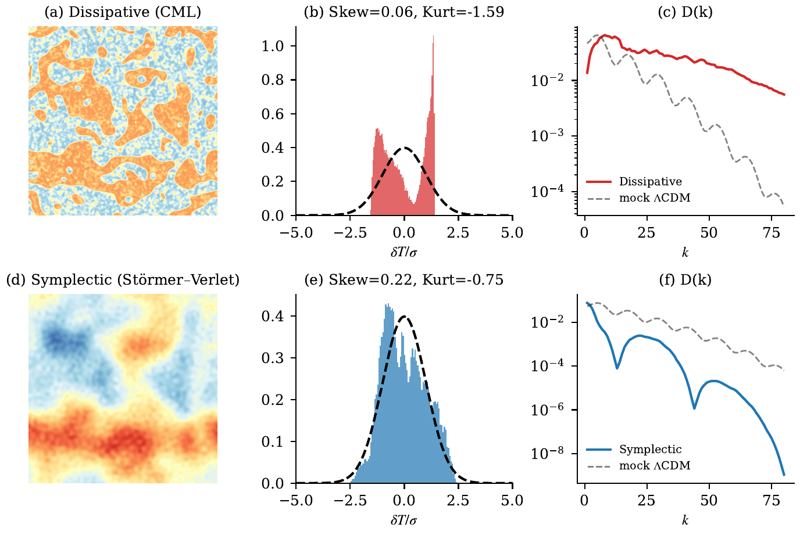
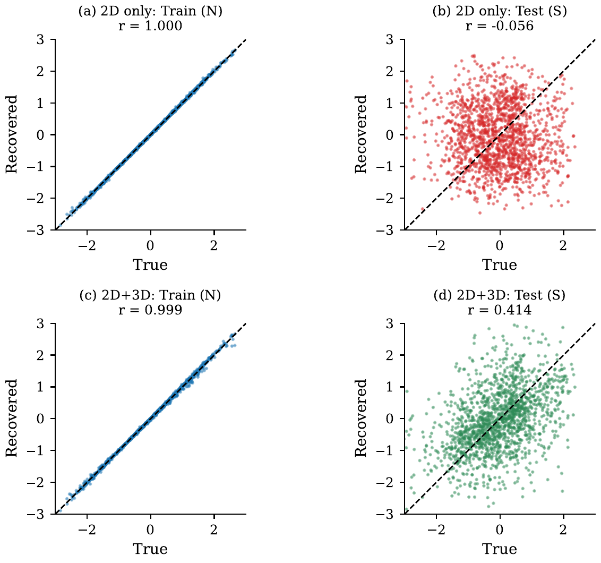

# DSC-CMB: Differentiable Discrete Symplectic Cosmology

Code and experiments for the paper:

> **Differentiable Discrete Symplectic Cosmology: Forward Simulation and Inverse Reconstruction of CMB-like Fluctuations**
>
> Liang Wang, School of Artificial Intelligence and Automation, Huazhong University of Science and Technology

## Key Results

### 3D Full-Sky CMB Map + Acoustic Peaks + Ablation + Planck Comparison

**(a)** Full-sky CMB map from 3D Störmer-Verlet evolution (128³ lattice), projected onto Mollweide sphere. **(b)** Acoustic oscillation peaks in D(k). **(c)** Ablation: only symplectic dynamics restores Gaussianity. **(d)** DSC vs Planck pixel distribution.

### Differentiable Inverse Reconstruction from Real Planck Data

**(a)** Real Planck SMICA target. **(b)** DSC reconstruction (pixel correlation r = 0.98). **(c)** Inferred 3D cosmic web. **(d)** Loss convergence. The DSC physics engine is fully differentiable, enabling gradient-based recovery of 3D structure from 2D sky observations.

### Ablation: Symplectic vs Dissipative Dynamics

Dissipative CML (top) produces topological defects and non-Gaussian statistics (kurtosis = -1.60). Symplectic Störmer-Verlet (bottom) restores near-Gaussian fluctuations with acoustic structure (spectral correlation r = 0.96 vs 0.74).

### Breaking the Projection Degeneracy with 3D Anchors

2D-only reconstruction overfits (test r = -0.06). Adding 25% volumetric 3D anchor points breaks the line-of-sight degeneracy (test r = 0.41), pointing toward multi-probe joint inference with DESI/Euclid.

## Overview

This repository implements the Discrete Symplectic Cosmology (DSC) framework for generating CMB temperature anisotropies from Störmer-Verlet symplectic lattice dynamics with 1/ln²(t) adiabatic cooling.

Key findings:
- Near-Gaussian fluctuations from symplectic evolution (skew = +0.06 ± 0.31, kurt = -0.10 ± 0.26)
- Acoustic-like oscillation peaks emerge naturally from wave propagation (5-6 peaks)
- Finite acoustic horizon via asymptotic freeze-out (r_s ≈ 38)
- Differentiable physics engine enables gradient-based inverse reconstruction (r = 0.98)
- Parameter recovery via Bayesian optimization (MSE = 8.9e-5)
- Reconstructed 3D field obeys P(k) ∝ k⁻³ gravity scaling without explicit regularization

## Repository Structure

```
dsc-cmb-paper/
├── README.md
├── assets/                                  # PNG figures for README
├── src/
│   └── dsc_engine.py                        # Shared physics engine module
├── notebooks/
│   ├── 01_symplectic_vs_dissipative.ipynb   # Ablation: symplectic vs CML
│   ├── 02_acoustic_peaks.ipynb              # Acoustic oscillation peaks
│   ├── 03_twin_experiment.ipynb             # SBI parameter recovery
│   ├── 04_freezeout.ipynb                   # Acoustic horizon freeze-out
│   ├── 05_ensemble_statistics.ipynb         # 20-run ensemble + QQ plot
│   ├── 06_parameter_sensitivity.ipynb       # Parameter robustness scan
│   ├── 07_3d_mollweide_cmb.ipynb            # 3D full-sky CMB map
│   ├── 08_planck_comparison.ipynb           # Planck SMICA comparison
│   ├── 09_inverse_reconstruction.ipynb      # Differentiable inverse recon
│   ├── 10_grf_null_test.ipynb               # Gaussian random field baseline
│   ├── 11_convergence_test.ipynb            # Lattice-size convergence
│   ├── 12_degeneracy_breaking.ipynb         # 3D anchor degeneracy breaking
│   └── 13_cosmic_timeline.ipynb             # BB → CMB → Cosmic Web timeline
├── paper/
│   ├── main.tex                             # LaTeX source (15 pages, PRD format)
│   ├── main.pdf                             # Compiled paper
│   ├── sections/                            # Section files
│   └── references.bib                       # Bibliography
├── figures/                                 # Generated figures (PDF, publication quality)
└── data/                                    # Planck SMICA fits (not included, ~1.9GB)
```

## Quick Start

```bash
pip install numpy scipy matplotlib healpy optuna
# For inverse reconstruction notebooks (09, 12):
pip install jax jaxlib optax
```

Run any notebook:
```bash
cd notebooks
jupyter notebook 01_symplectic_vs_dissipative.ipynb
```

## Notebook → Paper Figure Mapping

| Notebook | Paper Figure | Key Result |
|----------|-------------|------------|
| 01 | Fig 2 | Symplectic r=0.96 vs dissipative r=0.74 |
| 02 | Fig 3 | 5-6 acoustic peaks emerge naturally |
| 03 | Fig 4 | 3 parameters recovered (MSE=8.9e-5) |
| 04 | Fig 5 | Acoustic horizon r_s ≈ 38 |
| 05 | Fig 6 | skew=+0.06±0.31, kurt=-0.10±0.26 |
| 06 | Fig 7 | Robust across wide parameter range |
| 07 | Fig 1(a) | 3D Mollweide CMB map |
| 08 | Fig 8 | DSC skew=-0.075 vs Planck -0.036 |
| 09 | Fig 9 | Inverse reconstruction r=0.98 |
| 10 | Fig 10 | GRF null test |
| 11 | Fig 12 | Convergence for N≥200 |
| 12 | Fig 15 | 3D anchors break degeneracy (r: -0.06→0.41) |
| 13 | Fig 16 | BB→CMB→Cosmic Web V-shape transition |

## Data

The Planck SMICA map (`COM_CMB_IQU-smica_2048_R3.00_full.fits`, ~1.9GB) is required for notebooks 08, 09, 12, 13.

**Download steps:**
1. Visit [ESA Planck Legacy Archive](https://pla.esac.esa.int/)
2. Click **MAPS** → **CMB maps**
3. Download the **Full Mission** row: `COM_CMB_IQU-smica_2048_R3.00_full.fits`
4. Place the file in the `data/` directory (replace the existing symlink)

## DSC Theory

The theoretical framework is described in:

> Wang, L. (2026). *Discrete Symplectic Cosmology: A Phenomenological Framework for Time-dependent Vacuum Energy from Planck-Lattice Spectral Statistics* (v2.0). Zenodo. https://doi.org/10.5281/zenodo.19429778

Core equation (Störmer-Verlet with DSC cooling):
```
φ_{n+1} = 2φ_n - φ_{n-1} + c²(n)·∇²φ_n - η·(φ_n - φ_{n-1})
c²(n) = c²_base / ln²(n + c₀)
```

## Citation

```bibtex
@article{Wang2026DSC_CMB,
  author  = {Wang, Liang},
  title   = {Differentiable Discrete Symplectic Cosmology: Forward Simulation and Inverse Reconstruction of CMB-like Fluctuations},
  year    = {2026},
  note    = {Submitted to Physical Review D}
}
```

## License

MIT
