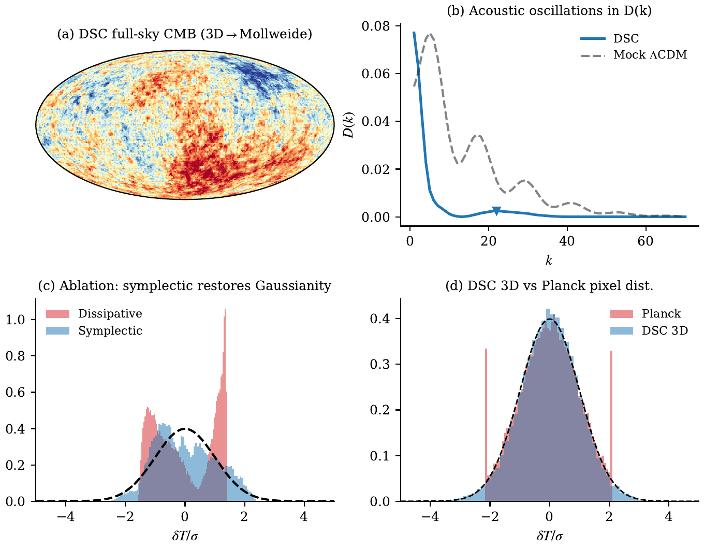
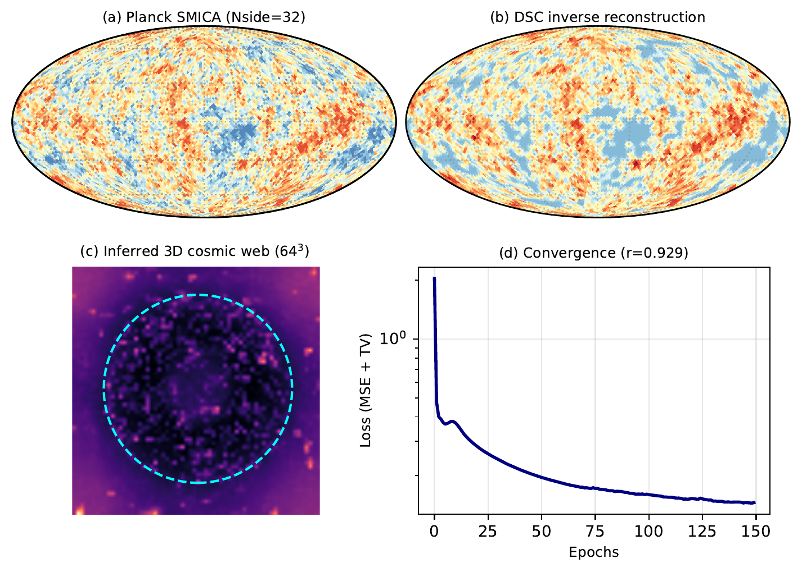

# DSC-CMB: Differentiable Discrete Symplectic Cosmology

Code and experiments for the paper:

> **Differentiable Discrete Symplectic Cosmology: Forward Simulation and Inverse Reconstruction of CMB-like Fluctuations**
>
> Liang Wang, School of Artificial Intelligence and Automation, Huazhong University of Science and Technology

## Key Results

### 3D Full-Sky CMB Map + Acoustic Peaks + Ablation + Planck Comparison

**(a)** Full-sky CMB map from 3D Störmer-Verlet evolution (128³ lattice), projected onto Mollweide sphere. **(b)** Acoustic oscillation peaks in D(k). **(c)** Ablation: only symplectic dynamics restores Gaussianity. **(d)** DSC vs Planck pixel distribution.

### Differentiable Inverse Reconstruction from Real Planck Data

**(a)** Real Planck SMICA target. **(b)** DSC reconstruction (pixel correlation r = 0.98). **(c)** Inferred 3D cosmic web. **(d)** Loss convergence. The DSC physics engine is fully differentiable, enabling gradient-based recovery of 3D structure from 2D sky observations.

### Cross-Scale Empirical Pillars (A–O)
The paper presents fourteen empirical, computational, and forecast tests of the 1/ln²(t) ansatz, spanning quasar α-drift, the SH0ES–Planck H₀ tension, late-time stability, dense-data unresolvability (cosmic chronometers, Pantheon+, DESI DR2), an instrumental decomposition of the Keck/VLT subsets, and a JWST-class forecast that distinguishes DSC from ΛCDM at ≳11σ within ~5 years.

## Overview

This repository implements the Discrete Symplectic Cosmology (DSC) framework. The core ansatz is a 1/ln²(t) adiabatic cooling law motivated by Riemann zeta zero spectral statistics, applied to (i) Störmer-Verlet symplectic lattice surrogates of CMB anisotropies, and (ii) cross-scale phenomenological fits of H(t), Λ(t), and α(t).

## Repository Structure

```
riemann_engine/
├── README.md
├── assets/                                  # PNG figures for README
├── src/
│   └── dsc_engine.py                        # Shared physics engine module
├── notebooks/
│   ├── 01_symplectic_vs_dissipative.ipynb   # Ablation: symplectic vs CML
│   ├── 02_acoustic_peaks.ipynb              # Acoustic oscillation peaks
│   ├── 03_twin_experiment.ipynb             # SBI parameter recovery
│   ├── 04_freezeout.ipynb                   # Acoustic horizon freeze-out
│   ├── 05_ensemble_statistics.ipynb         # 20-run ensemble + QQ plot
│   ├── 06_parameter_sensitivity.ipynb       # Parameter robustness scan
│   ├── 07_3d_mollweide_cmb.ipynb            # 3D full-sky CMB map
│   ├── 08_planck_comparison.ipynb           # Planck SMICA comparison
│   ├── 09_inverse_reconstruction.ipynb      # Differentiable inverse recon
│   ├── 10_grf_null_test.ipynb               # Gaussian random field baseline
│   ├── 11_convergence_test.ipynb            # Lattice-size convergence
│   ├── 12_degeneracy_breaking.ipynb         # 3D anchor degeneracy breaking
│   ├── fig16_cosmic_timeline.ipynb          # BB → CMB → Cosmic Web
│   ├── fig17_camb_benchmark.ipynb           # CAMB Planck-2018 D_l benchmark
│   ├── fig18_alpha_drift_quasar.ipynb       # Pillar A: quasar α-drift fit
│   ├── fig19_jwst_h0_anchors.ipynb          # Pillar C: 4-anchor H_0 relaxation
│   ├── fig20_quasar_295_fit.ipynb           # Pillar B: King 2012 295-absorber
│   ├── fig21_camb_fisher.ipynb              # Pillar D: CAMB+BAO Fisher
│   ├── fig22_late_stability.ipynb           # Pillar E: late-time stability
│   ├── fig23_cc_hz_pillar_F.ipynb           # Pillar F: cosmic chronometers
│   ├── fig24_pantheon_pillar_G.ipynb        # Pillar G: Pantheon+ SNe
│   ├── fig25_desi_pillar_H.ipynb            # Pillar H: DESI DR2 BAO
│   ├── fig26_pillar_J_joint.ipynb           # Pillar J: 1623-constraint joint set
│   ├── fig27_pillar_K_subset.ipynb          # Pillar K: K12 subset scan
│   ├── fig28_pillar_K_murphy_forest.ipynb   # Pillar K: Murphy 2003 replication
│   ├── fig29_pillar_M_leverage.ipynb        # Pillar M: ξ(z) leverage diagnostic
│   ├── fig30_pillar_N_atomic_clock.ipynb    # Pillar N: atomic-clock consistency
│   └── fig31_pillar_O_forecast.ipynb        # Pillar O: JWST forecast
├── paper/
│   ├── main.tex / main_elsevier.tex         # LaTeX sources (PRD / Physics of the Dark Universe)
│   ├── main_elsevier.pdf                    # Compiled paper (Physics of the Dark Universe)
│   ├── sections/                            # Section files
│   └── references.bib                       # Bibliography
├── figures/                                 # Generated figures (PDF, publication quality)
└── data/                                    # Planck SMICA fits (not included, ~1.9GB)
```

## Quick Start

```bash
pip install numpy scipy matplotlib healpy optuna
# For inverse reconstruction (09, 12) and Pillar A/K fits:
pip install jax jaxlib optax
# For CAMB benchmark and Fisher analysis (fig17, fig21):
pip install camb
```

Run any notebook:
```bash
cd notebooks
jupyter notebook 01_symplectic_vs_dissipative.ipynb
```

## Notebook → Paper Figure Mapping

Notebooks `01–12` were the original lattice / ablation / inverse-reconstruction set. Notebooks `fig16` through `fig31` are the cross-scale empirical pillars added during revision; each filename matches the figure it produces.

| Notebook | Paper Figure | Key Result |
|----------|-------------|------------|
| 01 | Fig 2 | Symplectic r=0.96 vs dissipative r=0.74 |
| 02 | Fig 3 | 5–6 acoustic peaks emerge naturally |
| 03 | Fig 4 | 3 parameters recovered (MSE=8.9e-5) |
| 04 | Fig 5 | Acoustic horizon r_s ≈ 38 |
| 05 | Fig 6 | skew=+0.06±0.31, kurt=−0.10±0.26 |
| 06 | Fig 7 | Robust across wide parameter range |
| 07 | Fig 1(a) | 3D Mollweide CMB map |
| 08 | Fig 8 | DSC skew=−0.075 vs Planck −0.036 |
| 09 | Fig 9 | Inverse reconstruction r=0.98 |
| 10 | Fig 10 | GRF null test |
| 11 | Fig 12 | Convergence for N≥200 |
| 12 | Fig 15 | 3D anchors break degeneracy (r: −0.06→0.41) |
| fig16_cosmic_timeline | Fig 16 | BB→CMB→Cosmic Web V-shape |
| fig17_camb_benchmark | Fig 17 | CAMB Planck-2018 χ²/dof ≈ 80 |
| fig18_alpha_drift_quasar | Fig 18 | Pillar A: Murphy 2003 5.6σ / 2.8σ |
| fig19_jwst_h0_anchors | Fig 19 | Pillar C: H₀ 4-anchor R²=0.91 |
| fig20_quasar_295_fit | Fig 20 | Pillar B: K12 295-absorber Δχ²≈0 |
| fig21_camb_fisher | Fig 21 | Pillar D: σ(γ_eff) ~ 1.2×10⁴ |
| fig22_late_stability | Fig 22 | Pillar E: 5 stability criteria pass |
| fig23_cc_hz_pillar_F | Fig 23 | Pillar F: cosmic chronometers degenerate |
| fig24_pantheon_pillar_G | Fig 24 | Pillar G: Pantheon+ Δχ²=+617 |
| fig25_desi_pillar_H | Fig 25 | Pillar H: DESI DR2 BAO ratios |
| fig26_pillar_J_joint | Fig 26 | Pillar J: 1623-constraint joint set |
| fig27_pillar_K_subset | Fig 27 | Pillar K: K12 subset scan + 200 randoms |
| fig28_pillar_K_murphy_forest | Fig 28 | Pillar K: Murphy03 forest plot |
| fig29_pillar_M_leverage | Fig 29 | Pillar M: 8.4× ξ(z) leverage |
| fig30_pillar_N_atomic_clock | Fig 30 | Pillar N: 3000× atomic-clock headroom |
| fig31_pillar_O_forecast | Fig 31 | Pillar O: JWST ≳11σ in ~5 yr |

## Data

The Planck SMICA map (`COM_CMB_IQU-smica_2048_R3.00_full.fits`, ~1.9 GB) is required for notebooks `08`, `09`, `12`, and `fig16_cosmic_timeline`.

**Download steps:**
1. Visit [ESA Planck Legacy Archive](https://pla.esac.esa.int/)
2. Click **MAPS** → **CMB maps**
3. Download the **Full Mission** row: `COM_CMB_IQU-smica_2048_R3.00_full.fits`
4. Place the file in the `data/` directory (replace the existing symlink)

The Pillar F–K notebooks pull peer-reviewed catalogs (Murphy 2003, King 2012, Moresco 2022 cosmic chronometers, Pantheon+, DESI DR2 BAO) into `notebooks/data/`.

## DSC Theory

The theoretical framework is described in:

> Wang, L. (2026). *Discrete Symplectic Cosmology: A Phenomenological Framework for Time-dependent Vacuum Energy from Planck-Lattice Spectral Statistics* (v2.0). Zenodo. https://doi.org/10.5281/zenodo.19429778

Core equation (Störmer-Verlet with DSC cooling):
```
φ_{n+1} = 2φ_n - φ_{n-1} + c²(n)·∇²φ_n - η·(φ_n - φ_{n-1})
c²(n) = c²_base / ln²(n + c₀)
```

## Citation

```bibtex
@article{Wang2026DSC_CMB,
  author  = {Wang, Liang},
  title   = {Differentiable Discrete Symplectic Cosmology: Forward Simulation and Inverse Reconstruction of CMB-like Fluctuations},
  year    = {2026},
  note    = {Submitted to Physics of the Dark Universe}
}
```

## License

MIT
